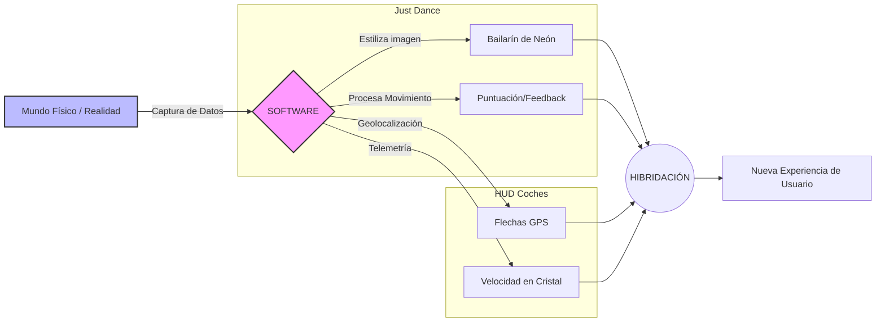

# PEC3: Visionando el futuro con las gafas de Manovich: redescubriendo la hibridación
**Nombre:** Ángela Calvo Tejedor  
**Fecha:** 15/05/26  
**Asignatura:** Cultura Digital

# Introducción

En su obra fundamental _El software toma el mando_, Lev Manovich nos planteó una idea revolucionaria: los medios ya no son entidades aisladas, sino que se han convertido en datos modulares gestionados por software. Hoy, en 2026, esta premisa es más real que nunca. No vivimos simplemente en una era multimedia donde vemos un vídeo junto a un texto; vivimos en la era de la **hibridación**.

Pero, ¿qué significa esto realmente? Para mí, la hibridación es el proceso por el cual diferentes lenguajes (el cine, la música, el diseño, la cartografía) pierden sus fronteras físicas para fusionarse en un solo ecosistema digital. Gracias al software, las propiedades de un medio pueden "contagiar" a otro, creando experiencias que antes eran técnicamente imposibles.

En este ensayo, quiero alejarme de los ejemplos clásicos y explorar cómo esta hibridación se ha filtrado en mi propia cotidianidad y en la de millones de personas a través de dos casos muy distintos pero igualmente fascinantes: la gamificación del movimiento en **Just Dance** y la superposición de datos en la conducción mediante los sistemas **Head-up Display (HUD)**.

## Caso 1: Just Dance o la hibridación entre el cuerpo y el dato

Just Dance no es solo un videojuego musical; es un ecosistema donde el software actúa como un puente entre la coreografía humana y la estética digital. Al analizarlo con las "gafas de Manovich", observamos una **hibridación profunda** entre la captura de la realidad, el diseño gráfico y la reducción del movimiento a datos procesables.

* ### La estética

Un aspecto fascinante de su producción es que la imagen que vemos no es una animación digital pura. El proceso de creación es en sí mismo un ejercicio de hibridación: se graba a **bailarines reales** caracterizados físicamente para el juego, pero el software procesa esa imagen hasta otorgarle esa estética de "neón" tan futurista que le caracteriza. Esta técnica convierte al cuerpo humano en un objeto plástico que el software puede estilizar hasta que sea casi irreconocible, creando una identidad visual tan potente que hoy, años después, la asociamos inmediatamente con la marca del juego.

* ### La "vigilancia" del algoritmo y la paradoja del mando

Como bien apunta Manovich, en la cultura del software el usuario ya no es un espectador pasivo. En Just Dance, la clave reside en que el software nos **vigila** y puntúa. Sin embargo, aquí aparece una contradicción interesante en la hibridación: el sistema no analiza el cuerpo completo, sino que reduce toda la complejidad del baile al movimiento de un solo punto (el mando o el guante en la mano derecha).

Desde mi punto de vista, este es un punto donde la hibridación puede "fallar" o ser limitada: alguien puede obtener la máxima puntuación simplemente moviendo el brazo con precisión, sin necesidad de ejecutar la coreografía completa con las piernas o el torso. Aquí vemos cómo el software **simplifica la realidad física para convertirla en un dato cuantificable**, priorizando la eficiencia del algoritmo sobre la pureza del baile. Aun así, es precisamente esta competitividad basada en el progreso y el "feedback" inmediato lo que genera el compromiso del jugador, algo que un simple vídeo de YouTube no podría lograr.

* ### Una experiencia cinética y colectiva

A pesar de sus limitaciones técnicas, Just Dance logra una hibridación social única, especialmente en contextos familiares y colectivos. Rompe con el estereotipo del videojuego sedentario al convertir el salón en una pista de baile donde el cuerpo es el periférico principal. El feedback visual (mensajes de "Perfect" o "Good") se superpone a la imagen, creando una **interfaz híbrida** que mantiene la tensión y las ganas de mejorar. En definitiva, es un ejemplo de cómo el software toma una actividad milenaria y la transforma en un producto donde el resultado depende de la curiosa fusión entre el movimiento humano y el procesamiento de datos.

## Caso 2: Head-up Display (HUD) y la hibridación del parabrisas

El segundo caso de estudio nos lleva fuera del ámbito del ocio para entrar en la utilidad cotidiana: los sistemas **Head-up Display (HUD)** en los vehículos modernos. Aquí, la hibridación no ocurre en una pantalla cerrada, sino que el propio cristal del coche se convierte en una interfaz donde se fusionan el mundo físico y las capas de datos digitales.

* #### La realidad aumentada como nueva capa de visión

Según Manovich, el software permite superponer capas de información sobre nuestra realidad, creando lo que llamamos **Realidad Aumentada (RA)**. En el HUD, elementos como la velocidad, las señales de tráfico o las flechas del GPS parecen "flotar" sobre el asfalto. Esta hibridación busca aumentar la seguridad al evitar que el conductor desvíe la mirada, pero como analizo en este ensayo, es un arma de doble filo. Aunque el software intenta ayudarnos, tener gráficos moviéndose constantemente frente a nuestros ojos puede generar una sobrecarga visual que confunda lo real con lo proyectado.

* #### ¿Videojuego o herramienta de seguridad?

Es innegable que la estética del HUD recuerda a la interfaz de un videojuego, donde los datos de telemetría acompañan siempre al jugador. Sin embargo, considero que esta tecnología no crea una dependencia absoluta. A diferencia de otros procesos automatizados, el HUD es una "ayuda visual"; si se apagara, el conductor seguiría sabiendo operar el vehículo. El software aquí no sustituye la habilidad humana, sino que la intenta potenciar. Aun así, existe el riesgo de que la hibridación convierta la carretera en algo monótono. A veces, el pequeño gesto de consultar el GPS lateral ayuda a mantener la mente activa; eliminar cualquier estímulo fuera del eje de visión podría, paradójicamente, aumentar el cansancio mental por la monotonía del campo visual.

* #### El futuro del parabrisas: ¿Transparencia o saturación?

Desde un punto de vista estético y cultural, el HUD representa una visión moderna y tecnológica del transporte. Sin embargo, no creo que la hibridación deba llegar a cubrir todo el parabrisas. Para muchos conductores, entre los que me incluyo, el placer de conducir reside en la apreciación directa de la carretera y el paisaje. Si el software llega a "manchar" toda nuestra visión, perderíamos la esencia de la experiencia física de viajar.

En conclusión, el HUD es un ejemplo brillante de cómo el software puede hibridar un objeto físico (un cristal) con un flujo constante de datos (GPS, sensores). Es una herramienta útil, pero cuya eficacia depende de nuestra capacidad para no dejar que la interfaz digital opaque la realidad física que tenemos delante.

## Gráfico resumen

## Conclusión
Tras analizar casos tan diversos como **Just Dance** y los sistemas **HUD**, se confirma la tesis de Lev Manovich: el software no es un medio más, sino la capa que los redefine a todos. La hibridación nos obliga a renegociar nuestra relación con la realidad, ya sea simplificando nuestros movimientos en un videojuego o aumentando nuestra visión en la carretera mediante capas de datos.

A nivel personal, mi formación en **DAW (Desarrollo de Aplicaciones Web)** me ha impulsado a abordar esta PEC desde una perspectiva técnica y experimental. He querido ir más allá de la redacción convencional de un ensayo, utilizando el lenguaje **Markdown** y la sintaxis de **Mermaid** para estructurar la información. La capacidad de integrar diagramas lógicos directamente en el repositorio de **GitHub** no es solo un recurso visual; es un ejercicio de hibridación en sí mismo, donde la escritura académica se fusiona con el flujo de trabajo del desarrollo de software.

En última instancia, la cultura digital de 2026 nos exige no solo ser consumidores, sino entender los lenguajes que construyen nuestra realidad híbrida. Como desarrolladora, considero que dominar estas herramientas de comunicación abierta es fundamental para participar en la creación de una cultura compartida y accesible.

## Bibliografía

   * Manovich, L. (2013). El Software toma el mando. Barcelona: Editorial UOC.
   * Markdown. (2024). Guía de sintaxis estándar. https://markdown.es/
   * StackEdit. (2024). Editor Markdown en línea. https://stackedit.io/
   * GitHub. (2024). Documentación oficial y repositorios. https://docs.github.com/es
   * Google. (2026). Gemini 3 Flash (versión 11 de mayo) [Large language model]. https://gemini.google.com/
        Metodología de uso: Se ha utilizado esta herramienta de IA para facilitar la investigación de datos técnicos, estructurar el contenido y la corrección ortográfica. (Google, 2026).
   * YouTube. Plataforma de recursos de vídeo: https://www.youtube.com/
